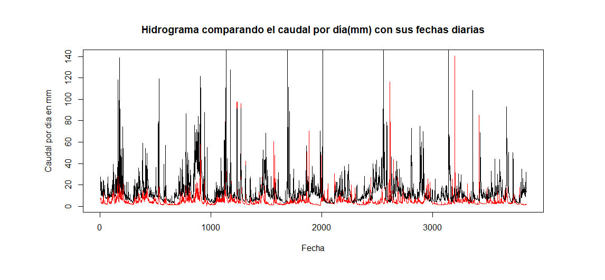
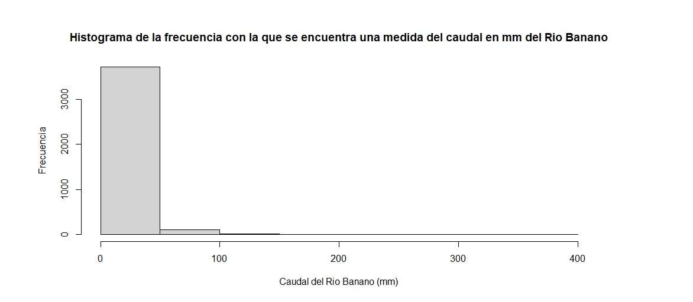
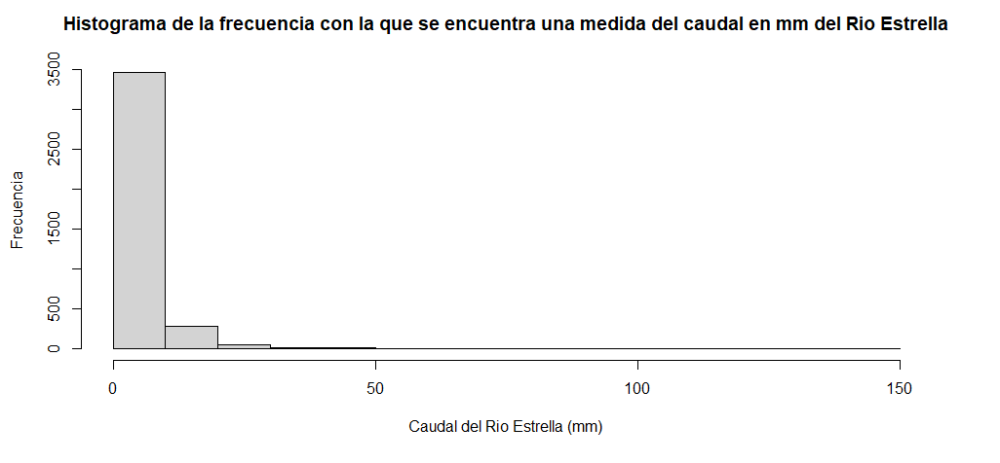
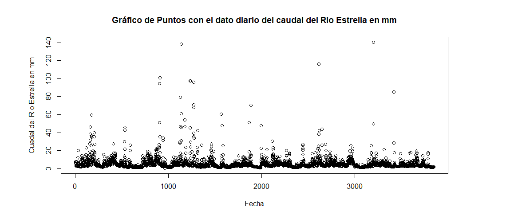
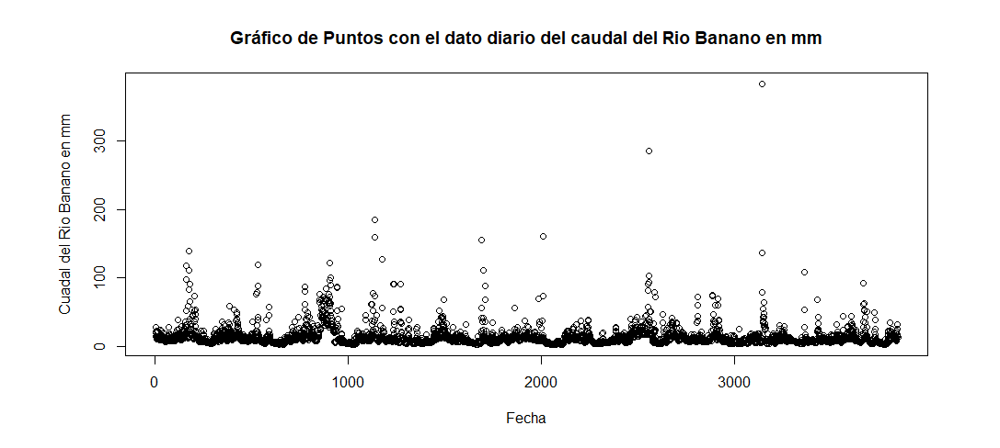
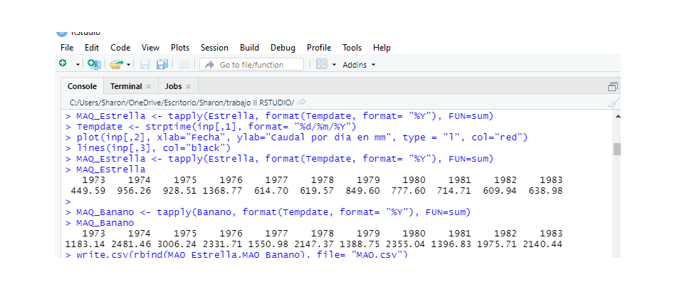

# Datos Hidrológicos 

### Ejercicio exploratorio

1. Se importa el archivo FDC desde el directorio de elección, luego se realiza un hidrograma para comprar el caudal por día en mm de ambos ríos con las fechas, se determina el color  el tipo de gráfico líneas, con: 

plot(inp[,2], main="Hidrograma comparando el caudal por día(mm) con sus fechas diarias", xlab="Fecha", ylab="Caudal por dia en mm", type = "l", col="red")   
lines(inp[,3], col="black")

**Figura 1. Hidrograma** 

2. Luego se hace un histograma como se distribuye el mínimo y el máximo, se evidencia la frecuencia con la que se encuentra una medida del caudal en mm por día.

summary(inp[,2:3])    
hist(inp[,2], xlab = "Caudal del Rio Estrella (mm)", ylab = "Frecuencia", main="Histograma de la frecuencia con la que se encuentra una medida del caudal en mm) del Rio Estrella")     
hist(inp[,3], xlab = "Caudal del Rio Banano (mm)", ylab = "Frecuencia", main="Histograma de la frecuencia con la que se encuentra una medida del caudal en mm del Rio Banano")   

**Figura 2. Histograma Rio Banano** 

**Figura3. Histograma Rio Estrella**   

3. Se hace un grafico de puntos y acá se nota el dato diario del Rio Estrella:  

plot(Estrella, xlab= "Fecha", ylab = "Cuadal del Rio Estrella en mm", main = "Gráfico de Puntos con el dato diario del caudal del Rio Estrella en mm")   

**Figura 4. Grafico de puntos dato diario del Rio Estrella.**   

**Figura 5. Grafico de puntos dato diario del Rio Banano.**   

4. Se define el formato de la fecha y tiempo de la serie con día, mes y año con la columna 1 de cada rio y se obtiene el acumulado por año en la consola del 73 al 83, además se reasignan los nombres:    

plot(Estrella)   
Tempdate <- strptime(inp[,1], format= "%d/%m/%Y")   
MAQ_Estrella <- tapply(Estrella, format(Tempdate, format= "%Y"), FUN=sum)  
write.csv(MAQ_Estrella, file= "MAQ.csv")   

  

**Figura 6. Consola** _ Captura 1 consola   

Y para exportar el caudal acumulado por año de cada rio en el directorio se digita:   

write.csv(rbind(MAQ_Estrella,MAQ_Banano), file= "MAQ.csv")    

y se obtiene un archivo MAQ en el directorio de trabajo del 73 al 83.   

**Figura 7. MAQ en el directorio de trabajo** _ CAPTURA 4 MAQ   

5. Para combinar el grafico de puntos del Rio Banano con el de líneas del Rio Estrella con color rojo,  se digita:  

plot(MAQ_Banano, xlab= "Fecha", ylim = c(100,3000))    
lines(MAQ_Estrella, col=2)    

Y se hace una comparación de ambos ríos, es más fácil para visualizar y arroja datos como por ejemplo, los años donde se presenta el Fenómeno del Niño.  

**Figura 8. Grafico comparativo de ambos Ríos**   
 
6. Para obtener un acumulado promedio mensual de los 10 años, en 12 columnas (12 meses) y que se defina  que variabilidad tiene el caudal por mes se digita y se obtiene en la consola:      

MMQ_Estrella <- tapply(Estrella, format(Tempdate, format= "%m"), FUN=sum)   
MMQ_Banano <- tapply(Banano, format(Tempdate, format= "%m"), FUN=sum)     
 
**Figura 9. Consola, datos mensuales**    

## Análisis de correlación titulo  

Para correlacionar los datos se utiliza cor y se pueden utilizar diferentes métodos, ejemplo Spearman que es no paramétrico y en la consola se obtiene la matriz de los caudales de ambos ríos con un coeficiente de correlación de aproximadamente 0.37, el cual es muy bajo ya que se encuentran ambos ríos muy cercanos y se grafica generando una nube de puntos:   

corinp <- cor(inp[,2:3], method = "spearman")    
plot(Estrella, Banano)    

**Figura 10. Grafico de Coeficiente de Correlación.**  Grafico 6     

## Análisis de Regresión Lineal titulo    

Y para realizar un análisis de regresión lineal, se obtiene que en eje y, el Rio Banano que es la variable independiente  y en el eje x, el Rio Estrella que es la variable dependiente. Y se obtiene un r cuadrado muy bajo lo que resulta problemático y se grafica:    

inp.lm <- lm(inp[,2] ~ inp[,3], data=inp)   
summary(inp.lm)   
plot (inp.lm)    

**Figura 11. Regresión Lineal**     

**Figura 12. Regresión Lineal**    

**Figura 13. Regresión Lineal**   

